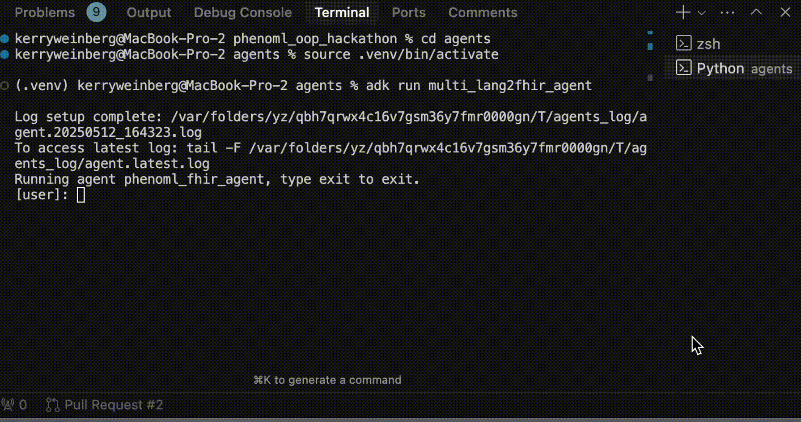

# PhenoML FHIR Agent

This agent provides tools for interacting with a FHIR server using PhenoML's lang2fhir API for natural language processing of healthcare data.

### Demo

Demo of an agent that you can build using this repo!



## Features

- Convert natural language descriptions to FHIR resources using PhenoML's lang2fhir API
- Convert natural language queries to FHIR search parameters
- Perform direct FHIR searches and resource creation on a FHIR server
- Automatically handle patient context for related resources

## Prerequisites

1. PhenoML account with access to the lang2fhir API
2. Medplum or Canvas Medical account (or other FHIR server) for storing created resources and executing FHIR searches
3. Python 3.8+

## Setup

1. Clone this repository

2. Install dependencies
   ```bash
   pip install -r requirements.txt
   ```

3. Authenticate and set up environment variables:

   a. **Set .env credentials**:
   Open the file `agents/.env` in your text editor of choice and set your
PhenoML credentials and either Medplum or Canvas credentials based on which
EMR you have chosen.

   b. **Obtain PhenoML Token**:
   ```bash
   # Run the PhenoML authentication script with --save flag to save to .env automatically. Assumes your credentials are in your .env already 
   python auth/phenoml_auth.py --save
   ```

   c. **Obtain Medplum Token** (if using Medplum):
   ```bash
   # Run the Medplum authentication script with --save flag to save to .env automatically. Assumes your credentials are in your .env already
   python3 auth/medplum_auth.py --save

   ```

   d. **Obtain Canvas Token** (if using Canvas):
   ```bash
   # Run the Canvas authentication script with --save flag to save to .env automatically. Assumes your credentials are in your .env already
   python3 auth/canvas_auth.py --save

   ```

## PhenoML lang2fhir API

This agent uses PhenoML's lang2fhir API, which provides:

- **Create endpoint**: Converts natural language to structured FHIR resources
- **Search endpoint**: Converts natural language to FHIR search parameters

For more information, visit: [PhenoML Documentation](https://developer.pheno.ml)

## License

[MIT](LICENSE) 
